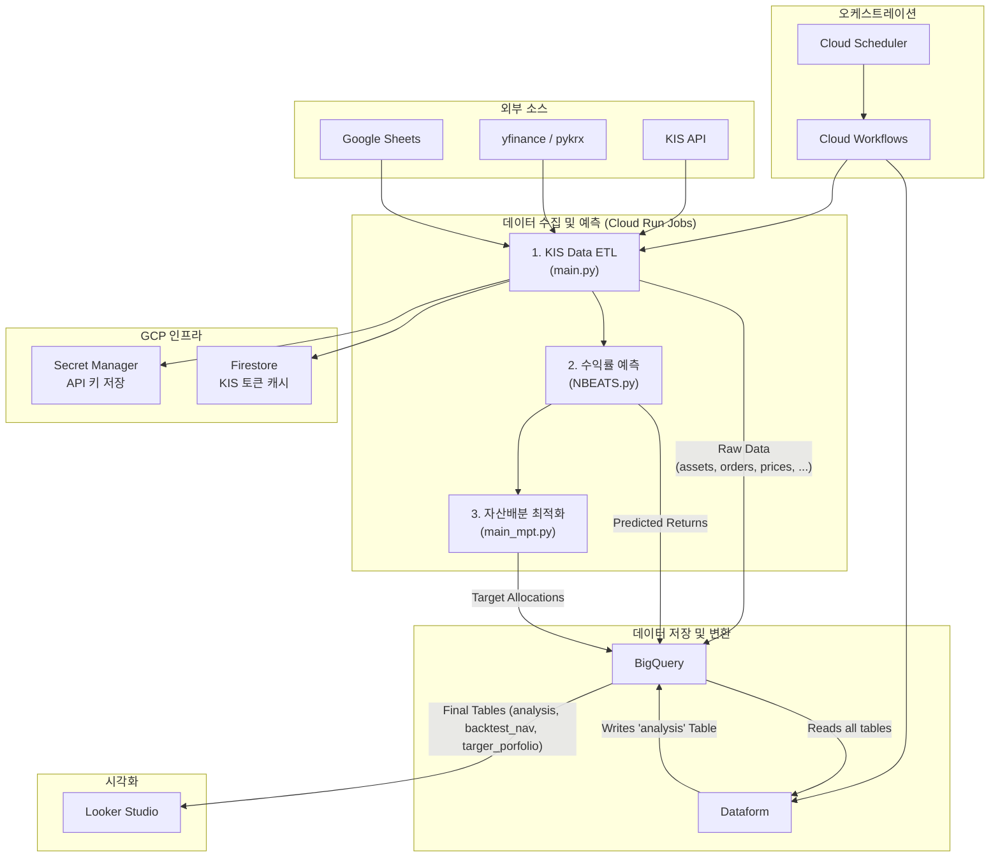

## 개인 포트폴리오 데이터 파이프라인 
수동적인 스프레드시트 자산 관리의 비효율을 해결하고자 GCP 기반의 자동화 데이터 파이프라인을 구축했습니다.  
KIS API 등 다양한 소스의 데이터를 BigQuery에 통합하고,  
보유종목에 대한 딥러닝(N-BEATS) 수익률 예측 및 포트폴리오 최적화(MPT) 모델을 적용하여 전략을 도출하고 목표비율 제시 및 백테스팅을 실행합니다.  
바이브코딩을 통한 AI 코드 생성과 무한 디버깅을 통해 구현했습니다.
매일 자동으로 데이터를 동기화하고 분석 결과를 Looker Studio 대시보드에서 시각화합니다.

-----

### **1. 아키텍처**

- 전체 데이터 파이프라인은 GCP의 Cloud Workflows를 통해 오케스트레이션되며, 각 단계는 독립적인 서버리스 컴포넌트로 구성되어 있습니다.



- 루커스튜디오 링크(모바일용) : https://lookerstudio.google.com/reporting/4eab2fb1-54b6-4e0d-acd6-a77513563a20/page/A4BVF
  
<table>
  <tr>
    <td>
      
    </td>
    <td>
      
    </td>
    <td>
      
    </td>
  </tr>
</table>

-----

### **2. 주요 기능**

  * 자동화된 데이터 수집: KIS API를 통해 계좌 잔고, 자산 현황, 주문 내역을 매일 자동으로 가져옵니다.
  * 시장 데이터 통합: `yfinance`와 `pykrx`를 활용하여 개별 주식의 일별 시세(OHLCV), 배당 정보, 환율 등 시장 데이터를 수집합니다.
  * 수동 데이터 관리: 수Google Sheets에 수동으로 입력해야 하는 자산 정보를 파이프라인에 자동으로 통합합니다.
  * 시계열 예측 모델: 딥러닝 모델인 N-BEATS를 사용하여 각 자산의 미래 기대수익률을 예측하고, 이를 포트폴리오 최적화에 활용합니다.
  * 다양한 포트폴리오 최적화:
      * 현대 포트폴리오 이론(MPT) 기반 최소 분산(Min Volatility) 및 최대 샤프 지수(Max Sharpe) 전략
      * 계층적 리스크 패리티(HRP)
      * MPT와 HRP를 결합한 블렌딩 전략
      * N-BEATS 예측 수익률을 반영한 최적화 전략

-----

### **3. 기술 스택**

| 구분                  | 기술                                        |
| --------------------- | ------------------------------------------- |
| Cloud Platform | Google Cloud Platform (GCP) |
| Orchestration | Cloud Workflows |
| Compute | Cloud Run Jobs |
| Data Warehouse | BigQuery |
| Data Transformation | Dataform |
| CI/CD & Storage | Artifact Registry , Firestore , Secret Manager |
| Language & Frameworks | Python, SQL, YAML |
| Key Python Libraries | `pandas`, `google-cloud-bigquery`, `yfinance`, `pykrx`, `neuralforecast`, `pypfopt`, `cvxpy` |
| BI & Visualization | Looker Studio |

-----

### **4. 파이프라인 워크플로우**

Cloud Scheduler에 의해 매일 정해진 시간에 `workflow.yaml`이 트리거되며, 아래의 순서로 작업을 수행합니다.

- 데이터 수집 및 적재 (`main.py` 실행)  
      * KIS API: Secret Manager에서 API 키를 가져오고, Firestore에서 토큰을 확인/갱신하여 KIS 서버에서 계좌 정보(자산, 잔고, 주문 내역)를 가져옵니다.
      * 시장 데이터: BigQuery에 저장된 보유 종목 리스트를 기반으로 `yfinance`와 `pykrx`에서 필요한 기간의 시세, 배당, 환율 데이터를 가져옵니다.
      * 수동 데이터: `Google Sheets API`를 통해 지정된 시트의 데이터를 Pandas DataFrame으로 변환합니다. 시트데이터에 맞게 코드 커스터마이징이 필요합니다.
      * BigQuery 적재: 수집된 모든 데이터를 각각의 Raw 테이블(`assets`, `orders`, `daily_stock_prices` 등)에 `MERGE` 또는 `DELETE/INSERT` 방식으로 적재합니다.

- 기대수익률 예측 (`NBEATS.py` 실행)  
    * BigQuery의 `daily_stock_prices` 테이블에서 자산별 시계열 데이터를 로드합니다.
    * `neuralforecast` 라이브러리의 N-BEATS 모델을 사용하여 각 자산의 미래 로그 수익률을 예측합니다.
    * 예측된 값을 연간 기대수익률로 변환하여 `predicted_expected_returns` 테이블에 저장합니다.

- 자산배분 가중치 계산 (`main_mpt.py` 실행)  
    * BigQuery에서 과거 수익률 데이터와 `predicted_expected_returns` 테이블의 예측치를 로드합니다.
    * `pypfopt` 라이브러리를 활용하여 8가지 다른 전략에 대한 최적의 포트폴리오 가중치를 계산합니다.
    * 계산된 가중치와 각 포트폴리오의 예상 성과(기대수익률, 변동성, 샤프 지수)를 `target_allocations`와 `target_portfolios` 테이블에 저장합니다.
    * 과거 데이터를 사용한 워크포워드 방식의 백테스트를 수행하고 결과를 `backtest_nav` 테이블에 저장합니다.

- 최종 데이터 통합 (Dataform 실행)  
    * 지금까지 생성된 모든 테이블을 소스로 사용합니다.
    * `analysis.sqlx`에 정의된 SQL 로직을 통해 데이터를 조인하고, 수동 데이터를 오버레이하며, KRW 기준 평가금액 및 손익을 계산합니다.
    * 모든 정보가 집계된 `analysis` 테이블을 증분방식으로 업데이트합니다. 이 테이블은 Looker Studio 시각화의 최종 데이터 소스가 됩니다.

-----

### **5. 프로젝트 구조**

```
├── job-kis/                # 1. KIS 및 시장 데이터 ETL Cloud Run Job
│   ├── main.py             # 메인 ETL 스크립트
│   ├── import_orders.py    # (보조 스크립트)
│   ├── Dockerfile
│   └── requirements.txt
│
├── job-nb/                 # 2. N-BEATS 수익률 예측 Cloud Run Job
│   ├── NBEATS.py           # N-BEATS 모델 학습 및 예측
│   ├── Dockerfile
│   └── requirements.txt
│
├── job-mpt/                # 3. 포트폴리오 최적화 Cloud Run Job
│   ├── main_mpt.py         # MPT, HRP 등 가중치 계산
│   ├── Dockerfile
│   └── requirements.txt
│
├── dataform/               # 4. BigQuery 데이터 변환 (Dataform Repository)
│   └── definitions/
│       ├── analysis.sqlx   # 최종 분석 테이블 생성 로직
│       └── sources.js      # 소스 테이블 선언
│
├── workflow.yaml           # 전체 파이프라인 오케스트레이션

```
-----

### **6. 설치 및 배포**

- GCP 프로젝트 설정:  
    * GCP 프로젝트를 생성하고 결제를 활성화합니다.
    * 필요한 API (Cloud Run, BigQuery, Artifact Registry, Cloud Workflows, Secret Manager, Firestore 등)를 활성화합니다.

- 환경 구성:  
    * Secret Manager: `KISAPI`라는 이름으로 한국투자증권 API App Key와 Secret을 JSON 형식으로 저장합니다.
    * Firestore: `api_tokens` 컬렉션을 생성하여 KIS API 토큰을 캐싱할 수 있도록 준비합니다.
    * IAM: Cloud Run Job과 Dataform이 BigQuery 및 기타 서비스에 접근할 수 있도록 적절한 서비스 계정과 권한을 설정합니다.

- 애플리케이션 빌드 및 배포:  
    * 각 Python 스크립트(`main.py`, `NBEATS.py`, `main_mpt.py`)를 위한 `Dockerfile`을 작성합니다.
    * Docker 이미지를 빌드하여 Artifact Registry에 푸시합니다.
    * 푸시된 이미지를 사용하여 각각의 Cloud Run Job을 생성합니다.

- Dataform 및 워크플로우 배포:  
    * `dataform/` 디렉토리의 내용을 GCP Dataform 리포지토리 및 작업공간에 업로드합니다.
    * `workflow.yaml` 파일을 GCP Cloud Workflows에 배포합니다.
    * Cloud Scheduler를 설정하여 배포된 워크플로우를 주기적으로(예: 매일 오전 8시) 트리거합니다.
 
-----
